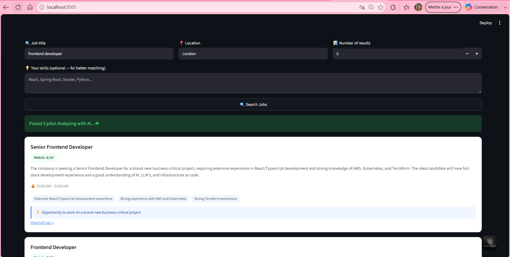

# 💼 Smart Job Search

AI-powered job search tool that finds remote jobs and analyzes each one instantly.

## Features
- 🔍 Search remote jobs by title
- 🤖 AI analysis for each job
- 📊 Match score based on your skills
- 💰 Salary estimates
- 🏷️ Skill requirements tags

## Built with
- Python
- Groq API (LLaMA 3.3)
- Streamlit
- Remotive API
- python-dotenv

## How to run
1. Clone the repo
2. Install: `pip install -r requirements.txt`
3. Add `GROQ_API_KEY` to `.env`
4. Run: `streamlit run app.py`

## Author
Syrine Ahmed — [GitHub](https://github.com/syrineahmed)

## Preview

## 🌐 Live Demo
👉 [Try it here](https://job-search-syrineahmed.streamlit.app/)
